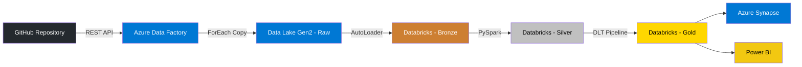
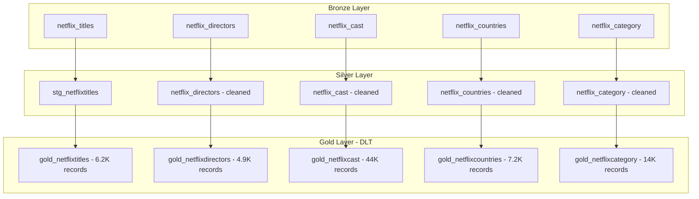
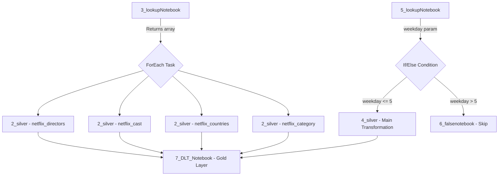
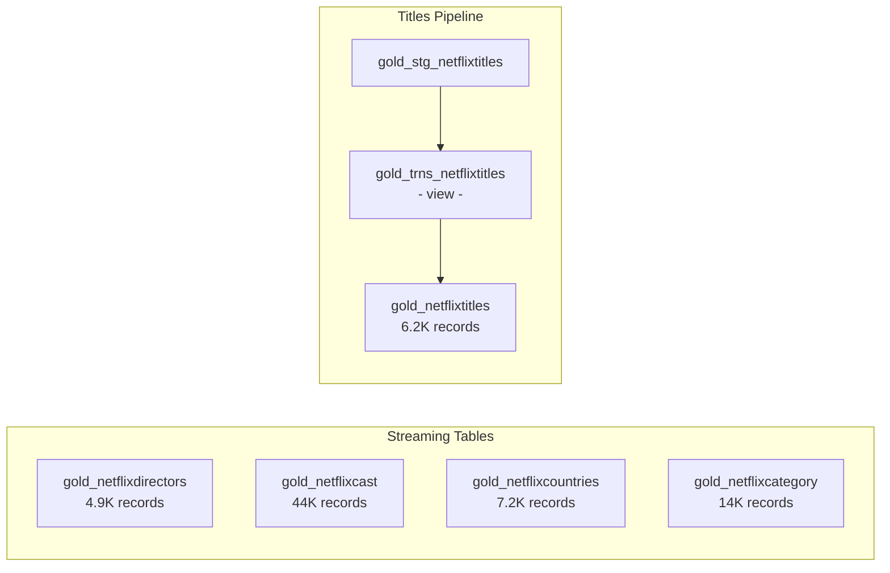

# 🎬 Netflix Azure Data Engineering Project

> **End-to-End Data Pipeline** built on Azure's **Medallion Architecture** — from raw data ingestion to business-ready analytics using Azure Data Factory, Databricks AutoLoader, PySpark, Delta Live Tables, and Unity Catalog.


---

## 📋 Table of Contents

- [Project Overview](#-project-overview)
- [Architecture](#-architecture)
- [Tech Stack](#-tech-stack)
- [End-to-End Workflow](#-end-to-end-workflow)
  - [Step 1: Azure Environment Setup](#step-1-azure-environment-setup)
  - [Step 2: Data Ingestion with Azure Data Factory](#step-2-data-ingestion-with-azure-data-factory)
  - [Step 3: Incremental Loading with AutoLoader (Bronze)](#step-3-incremental-loading-with-autoloader-bronze)
  - [Step 4: Data Transformation with PySpark (Silver)](#step-4-data-transformation-with-pyspark-silver)
  - [Step 5: Business Aggregation with Delta Live Tables (Gold)](#step-5-business-aggregation-with-delta-live-tables-gold)
  - [Step 6: Analytics Serving with Azure Synapse & Power BI](#step-6-analytics-serving-with-azure-synapse--power-bi)
- [Pipeline Flow Diagram](#-pipeline-flow-diagram)
- [Repository Structure](#-repository-structure)
- [Notebook Details](#-notebook-details)
- [Delta Live Tables Pipeline](#-delta-live-tables-pipeline)
- [Key Learnings & Challenges](#-key-learnings--challenges)
- [Prerequisites](#-prerequisites)
- [Dataset](#-dataset)
- [How to Run](#-how-to-run)

---

## 🎯 Project Overview

This project demonstrates a **production-grade data engineering pipeline** using Netflix movies & TV shows data. The pipeline follows the **Medallion Architecture** (Bronze → Silver → Gold) and incorporates:

- **Dynamic parameterized pipelines** in Azure Data Factory
- **Incremental data loading** using Databricks AutoLoader
- **PySpark transformations** with parameterized notebooks orchestrated via Databricks Workflows
- **Delta Live Tables (DLT)** for declarative gold-layer pipelines with data quality expectations
- **Unity Catalog** for centralized governance and access control
- **Azure Synapse Analytics** and **Power BI** for analytics serving

---

## 🏗 Architecture

```
┌─────────────┐     ┌──────────────────────┐     ┌──────────────────┐
│   GitHub     │────▶│  Azure Data Factory   │────▶│  Azure Data Lake │
│  (CSV Files) │     │  (Dynamic Pipeline)   │     │    Gen2 (Raw)    │
└─────────────┘     └──────────────────────┘     └────────┬─────────┘
                                                          │
┌─────────────┐     ┌──────────────────────┐              │
│  Data Lake   │────▶│  Databricks          │◀─────────────┘
│  (Raw Zone)  │     │  AutoLoader          │
└─────────────┘     └──────────┬───────────┘
                               │
                    ┌──────────▼───────────┐
                    │   BRONZE LAYER        │
                    │   (Delta Tables)      │
                    └──────────┬───────────┘
                               │
                    ┌──────────▼───────────┐
                    │   SILVER LAYER        │
                    │   PySpark + Workflows │
                    └──────────┬───────────┘
                               │
                    ┌──────────▼───────────┐
                    │   GOLD LAYER          │
                    │   Delta Live Tables   │
                    └──────────┬───────────┘
                               │
              ┌────────────────┼────────────────┐
              ▼                                 ▼
    ┌──────────────────┐             ┌──────────────────┐
    │  Azure Synapse    │             │    Power BI       │
    │  Analytics        │             │    (Reporting)    │
    └──────────────────┘             └──────────────────┘
```

---

## 🛠 Tech Stack

| Technology | Purpose |
|---|---|
| **Azure Data Factory** | Dynamic parameterized data ingestion pipelines |
| **Azure Data Lake Gen2** | Scalable cloud storage (Bronze/Silver/Gold containers) |
| **Azure Databricks** | Compute engine for transformations and orchestration |
| **Databricks AutoLoader** | Incremental file ingestion with schema inference |
| **PySpark** | Data transformation and cleaning |
| **Databricks Workflows** | Orchestration with ForEach, If/Else conditions |
| **Delta Live Tables (DLT)** | Declarative gold-layer pipelines with data quality |
| **Unity Catalog** | Centralized data governance and access control |
| **Azure Synapse Analytics** | Data warehousing and SQL analytics |
| **Power BI** | Business intelligence and reporting |

---

## 🔄 End-to-End Workflow

### Step 1: Azure Environment Setup

1. Created a **free Azure account** at [portal.azure.com](https://portal.azure.com)
2. Created a **Resource Group** to organize all project resources
3. Provisioned an **Azure Storage Account** with **Data Lake Gen2** enabled (hierarchical namespace)
4. Created three containers in the storage account:
   - `bronze` — Raw ingested data
   - `silver` — Cleaned and transformed data
   - `gold` — Business-ready aggregated data
5. Set up **Azure Databricks** workspace with Unity Catalog enabled
6. Configured **Access Connector for Azure Databricks** to securely connect to Data Lake
7. Created a **Unity Catalog Metastore** and linked it to the Databricks workspace
8. Registered the storage account as an **External Location** in Unity Catalog

### Step 2: Data Ingestion with Azure Data Factory


Built a **dynamic, parameterized pipeline** in Azure Data Factory that:

1. **Web Activity** — Calls the GitHub REST API to fetch file metadata from the Netflix data repository
2. **Set Variable** — Parses the API response to extract the list of CSV file URLs into an array
3. **Validation Activity** — Validates that the source data is accessible before proceeding
4. **ForEach Activity** — Iterates over the file array and copies each file to the Data Lake `bronze` container

```
Pipeline Flow:
Web Activity → Set Variable → Validation → ForEach (Copy Activity)
                                              ├── netflix_directors.csv
                                              ├── netflix_cast.csv
                                              ├── netflix_countries.csv
                                              └── netflix_category.csv
```

> **Key Feature:** The pipeline is fully parameterized — adding new files only requires updating the GitHub repository, no pipeline changes needed.

### Step 3: Incremental Loading with AutoLoader (Bronze)

Used **Databricks AutoLoader** (`cloudFiles` format) to incrementally ingest data from the Data Lake raw zone into Delta tables in the Bronze layer.

```python
# AutoLoader — Incremental ingestion
df = (spark.readStream
    .format("cloudFiles")
    .option("cloudFiles.format", "csv")
    .option("cloudFiles.schemaLocation", schema_location)
    .option("header", "true")
    .load(source_path))

df.writeStream \
    .option("checkpointLocation", checkpoint_path) \
    .option("mergeSchema", "true") \
    .trigger(availableNow=True) \
    .toTable(target_table)
```

**Bronze Tables Created:**
| Table | Description |
|---|---|
| `netflix_titles` | Main dataset — show_id, title, type, release_year, rating, description |
| `netflix_directors` | show_id → director mapping |
| `netflix_cast` | show_id → cast member mapping |
| `netflix_countries` | show_id → country mapping |
| `netflix_category` | show_id → genre/category mapping |

### Step 4: Data Transformation with PySpark (Silver)

Performed comprehensive PySpark transformations to clean and normalize the raw data:

- **Exploding arrays** — Split comma-separated directors, cast, countries, and categories into individual rows
- **Type casting** — Converted `date_added` to DateType, `release_year` to IntegerType
- **Null handling** — Replaced nulls and empty strings with meaningful defaults
- **Column splitting** — Separated `duration` into `duration_value` (int) and `duration_unit` (string)
- **Deduplication** — Removed duplicate records using `dropDuplicates()`

```python
# Example: Silver transformation for netflix_titles
df = spark.read.format("delta").load("abfss://bronze@storage.dfs.core.windows.net/netflix_titles")

# Split duration into value and unit
df = df.withColumn("duration_value", split(col("duration"), " ")[0].cast("int"))
df = df.withColumn("duration_unit", split(col("duration"), " ")[1])

# Cast date_added to proper date type
df = df.withColumn("date_added", to_date(trim(col("date_added")), "MMMM d, yyyy"))

# Write to silver layer
df.write.format("delta").mode("overwrite") \
    .save("abfss://silver@storage.dfs.core.windows.net/netflix_titles")
```

**Orchestration:** Used **Databricks Workflows** with:
- **Lookup Notebook** (`3_lookupNotebook.ipynb`) — Defines an array of source/target folder pairs
- **ForEach Task** — Iterates over the array, passing parameters to the silver notebook
- **Parameterized Notebooks** — Each notebook accepts `sourcefolder` and `targetfolder` widgets
- **If/Else Conditions** — Weekday-based conditional execution using `5_lookupNotebook.ipynb`

### Step 5: Business Aggregation with Delta Live Tables (Gold)

Built **Delta Live Tables (DLT)** pipelines for the gold layer with declarative data quality expectations:

```python
# Data quality rules
looktables_rules = {
    "rule1": "show_id is NOT NULL"
}

# Gold table with quality expectations
@dlt.table(name="gold_netflixdirectors")
@dlt.expect_all_or_drop(looktables_rules)
def myfunc():
    df = spark.readStream.format("delta") \
        .load("abfss://silver@storage.dfs.core.windows.net/netflix_directors")
    return df

# Staging → Transform View → Final table pattern
@dlt.table
def gold_stg_netflixtitles():
    df = spark.readStream.format("delta") \
        .load("abfss://silver@storage.dfs.core.windows.net/netflix_titles")
    return df

@dlt.view
def gold_trns_netflixtitles():
    df = spark.readStream.table("LIVE.gold_stg_netflixtitles")
    df = df.withColumn("newflag", lit(1))
    return df

masterdata_rules = {
    "rule1": "newflag is NOT NULL",
    "rule2": "show_id is NOT NULL"
}

@dlt.table
@dlt.expect_all_or_drop(masterdata_rules)
def gold_netflixtitles():
    df = spark.readStream.table("LIVE.gold_trns_netflixtitles")
    return df
```

### Step 6: Analytics Serving with Azure Synapse & Power BI

- Connected **Azure Synapse Analytics** to the Gold layer for SQL-based analytics
- Integrated **Power BI** with the Databricks SQL Warehouse using the `.pbids` connection file
- Enabled DirectQuery mode for real-time dashboard updates

---

## 📊 Pipeline Flow Diagram



### Medallion Architecture Detail



### Databricks Workflow Orchestration



### DLT Pipeline DAG



---

## 📁 Repository Structure

```
Netflix-Azure-Data-Engineering-Project/
│
├── 📓 1_AutoLoader.ipynb          # AutoLoader - Incremental bronze layer ingestion
├── 📓 2_silver.ipynb               # Silver lookup table transformations (parameterized)
├── 📓 3_lookupNotebook.ipynb       # Array parameter for ForEach iteration
├── 📓 4_silver.ipynb               # Main silver transformation (netflix_titles)
├── 📓 5_lookupNotebook.ipynb       # Weekday parameter for conditional execution
├── 📓 6_falsenotebook.ipynb        # Fallback notebook for non-weekday runs
├── 📓 7_DLT_Notebook.ipynb         # Delta Live Tables gold layer pipeline
│
├── 📄 databricks-cluster.pbids     # Power BI connection file for Databricks SQL
│
├── 🖼️ images/
│   ├── Workflow.png                # End-to-end architecture diagram
│   ├── Azure_Data_Factory_Workflow.png  # ADF pipeline screenshot
│   ├── DLT_Pipeline_1.png         # DLT graph - cast, category, countries
│   └── DLT_Pipeline_2.png         # DLT graph - directors, titles pipeline
│
└── 📄 README.md
```

---

## 📓 Notebook Details

### `1_AutoLoader.ipynb` — Bronze Layer Ingestion
- Creates the Unity Catalog schema (`netflix_catalog.net_schema`)
- Uses `cloudFiles` format for incremental CSV ingestion
- Configures `checkpointLocation` and `mergeSchema` for reliability
- Writes streaming data to Delta tables in the bronze container

### `2_silver.ipynb` — Silver Lookup Table Transformations
- Accepts `sourcefolder` and `targetfolder` as widget parameters
- Reads from bronze Delta tables
- Performs cleaning transformations (trim, null handling)
- Writes cleaned data to the silver container
- **Parameterized** — same notebook processes directors, cast, countries, and categories

### `3_lookupNotebook.ipynb` — Array Parameter Definition
- Defines a Python array of `{sourcefolder, targetfolder}` dictionaries
- Uses `dbutils.jobs.taskValues.set()` to pass the array to downstream ForEach tasks
- Enables dynamic iteration without hardcoding notebook paths

```python
files = [
    {"sourcefolder": "netflix_directors", "targetfolder": "netflix_directors"},
    {"sourcefolder": "netflix_cast",      "targetfolder": "netflix_cast"},
    {"sourcefolder": "netflix_countries",  "targetfolder": "netflix_countries"},
    {"sourcefolder": "netflix_category",   "targetfolder": "netflix_category"},
]
dbutils.jobs.taskValues.set(key="my_arr", value=files)
```

### `4_silver.ipynb` — Main Silver Transformation
- Reads the main `netflix_titles` table from the bronze layer
- **Transformations applied:**
  - `split(col("duration"), " ")` → `duration_value` + `duration_unit`
  - `to_date(trim(col("date_added")), "MMMM d, yyyy")` → proper DateType
  - `cast("int")` for release_year
  - `dropDuplicates()` for deduplication
  - `fillna()` for null handling
- Writes the staging table `stg_netflixtitles` to the silver layer

### `5_lookupNotebook.ipynb` — Weekday Conditional Parameter
- Creates a `weekday` widget (default: `"7"`)
- Passes the integer value downstream via `dbutils.jobs.taskValues.set()`
- Used by the Databricks Workflow If/Else condition to decide execution path

### `6_falsenotebook.ipynb` — Fallback Notebook
- Retrieves the `weekoutput` value from the upstream lookup task
- Prints the value for logging
- Acts as the "false" branch — runs when the weekday condition is not met (e.g., weekends)

### `7_DLT_Notebook.ipynb` — Gold Layer (Delta Live Tables)
- Defines **streaming tables** with `@dlt.table` decorator
- Applies data quality rules using `@dlt.expect_all_or_drop`
- Implements a **staging → transform view → final table** pattern for titles
- Creates five gold tables: directors, cast, countries, category, titles

---

## 📈 Delta Live Tables Pipeline

### Pipeline Run — Streaming Tables


*Streaming tables: gold_netflixcast (44K records), gold_netflixcategory (14K), gold_netflixcountries (7.2K)*


*Directors (4.9K), staging → transform view → gold_netflixtitles (6.2K records)*

### Gold Layer Tables Summary

| Gold Table | Records | Quality Rules | Source |
|---|---|---|---|
| `gold_netflixcast` | ~44,000 | `show_id IS NOT NULL` | silver/netflix_cast |
| `gold_netflixcategory` | ~14,000 | `show_id IS NOT NULL` | silver/netflix_category |
| `gold_netflixcountries` | ~7,200 | `show_id IS NOT NULL` | silver/netflix_countries |
| `gold_netflixdirectors` | ~4,900 | `show_id IS NOT NULL` | silver/netflix_directors |
| `gold_netflixtitles` | ~6,200 | `newflag IS NOT NULL`, `show_id IS NOT NULL` | silver/netflix_titles (via staging + view) |

---

## 💡 Key Learnings & Challenges

### What I Learned

| Area | Details |
|---|---|
| **Azure Free Tier** | Configured storage accounts, containers, and access connectors within Azure's $200 free credit |
| **Unity Catalog** | Set up access connectors, service principals, and metastore configuration for data governance |
| **AutoLoader** | Implemented incremental file processing with `cloudFiles` format — automatically detects new files |
| **Dynamic Pipelines** | Built parameterized ForEach activities in ADF with lookup notebooks for flexible data routing |
| **Databricks Workflows** | Orchestrated parameterized notebooks with task dependencies, ForEach loops, and If/Else conditions |
| **Delta Live Tables** | Created declarative pipelines with `expect_all_or_drop` for automated data quality enforcement |
| **PySpark** | Applied real-world transformations: exploding arrays, type casting, splitting columns, null handling |

### Challenges Faced

1. **Unity Catalog Metastore Configuration** — Required creating an Access Connector for Azure Databricks and granting it `Storage Blob Data Contributor` role on the storage account
2. **AutoLoader Schema Evolution** — Had to enable `mergeSchema` option to handle schema changes in incoming CSV files
3. **ADF Dynamic Pipeline** — Parsing the GitHub API response correctly to extract file URLs required careful JSON path expressions
4. **DLT Function Naming** — Delta Live Tables requires unique function names per table; reusing `myfunc` caused conflicts (resolved by using table-specific function names in production)
5. **Databricks Workflow Parameterization** — Passing array values between tasks using `dbutils.jobs.taskValues` required understanding the task key reference system

---

## ✅ Prerequisites

- **Azure Account** — Free tier with $200 credit ([Create here](https://azure.microsoft.com/en-us/free/))
- **Azure Subscription** — Comes with the free account
- **Resource Group** — To organize all project resources
- **Azure Storage Account** — With hierarchical namespace enabled (Data Lake Gen2)
- **Azure Data Factory** — For pipeline orchestration
- **Azure Databricks Workspace** — With Unity Catalog enabled
- **Stable Internet Connection** — For accessing Azure portal and services

---

## 📊 Dataset

**Netflix Movies and TV Shows Dataset**

- **Source:** [Kaggle - Netflix Movies and TV Shows](https://www.kaggle.com/datasets/shivamb/netflix-shows)
- **GitHub Repository:** Files hosted in GitHub for ADF ingestion
- **Format:** CSV files
- **Files:**
  - `netflix_titles.csv` — Main dataset (show_id, title, type, director, cast, country, date_added, release_year, rating, duration, listed_in, description)
  - `netflix_directors.csv` — show_id to director lookup
  - `netflix_cast.csv` — show_id to cast member lookup
  - `netflix_countries.csv` — show_id to country lookup
  - `netflix_category.csv` — show_id to genre/category lookup

---

## 🚀 How to Run

1. **Set up Azure environment** — Create resource group, storage account (Data Lake Gen2), and Databricks workspace
2. **Configure Unity Catalog** — Create metastore, access connector, and external locations
3. **Create ADF pipeline** — Build the dynamic pipeline with Web → Set Variable → Validation → ForEach activities
4. **Run ADF pipeline** — Ingest CSV files from GitHub to the bronze Data Lake container
5. **Execute `1_AutoLoader.ipynb`** — Load raw data incrementally into bronze Delta tables
6. **Create Databricks Workflow** — Configure `3_lookupNotebook` → ForEach(`2_silver`) and `5_lookupNotebook` → If/Else(`4_silver`/`6_falsenotebook`)
7. **Run the workflow** — Transform bronze data into silver Delta tables
8. **Create DLT pipeline** — Point to `7_DLT_Notebook.ipynb` and run to create gold streaming tables
9. **Connect Power BI** — Use the `.pbids` file or configure Databricks SQL Warehouse connection

---

## 📄 License

This project is for educational purposes. The Netflix dataset is sourced from Kaggle under their terms of use.

---

<p align="center">
  <b>Built with ❤️ using Azure · Databricks · Delta Live Tables · PySpark</b>
</p>
